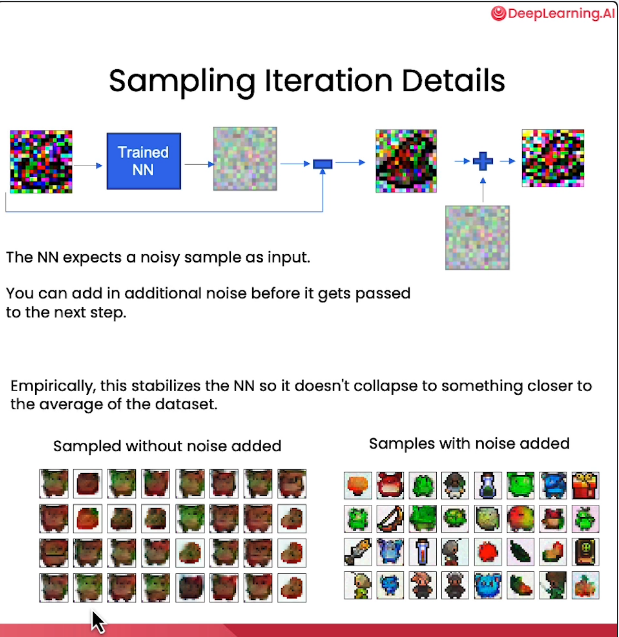

# Overview:
- This directory goes over how to train a diffusion model & sample from it, along with my notebooks from [1].
- It also compares DDPM (Denoising diffusion probabilistic model) &  DDIM (Denoising diffusion  implicit models)

# Concepts:
- During diffusion model training:
    1. The input (e.g. image) is perturbed with noise.
        - A random noise is sampled assuming a random timestep.
    2. The model predicts the noise in the input that needs to be removed to re-generate the input image.
        - MSE loss is used.
        -   
        -  
    3. The model can take in an optional context vector to control the output.
        -   

- During diffusion model sampling:
    1. An input noise vector is given. 
    2. The model predicts the noise in the input (for given timestep) that needs to be removed to re-generate the input image.
    3. This re-generated image is again given to the model as input & steps 1, 2 are repeated for some timesteps (e.g.500)
        - This re-generated image here is not normal distribution. So some additional noise is added to bring it close to normal distribution.
            -   
            - 
        - For this, a sampling schedule is followed (for e.g. DDPM/DDIM) to control the input distribution. This is a sequential process & expensive runtime wise.
        - Compared to DDPM, DDIM is
            - Faster. 
            - Skips some timesteps to speed-up the sampling. 
            - Determinstic (no noise vector). 
            - A sampling technique & any trained model can follow DDIM.
        - 
- U-Net model
    -    

# References:
1. https://learn.deeplearning.ai/courses/diffusion-models/
